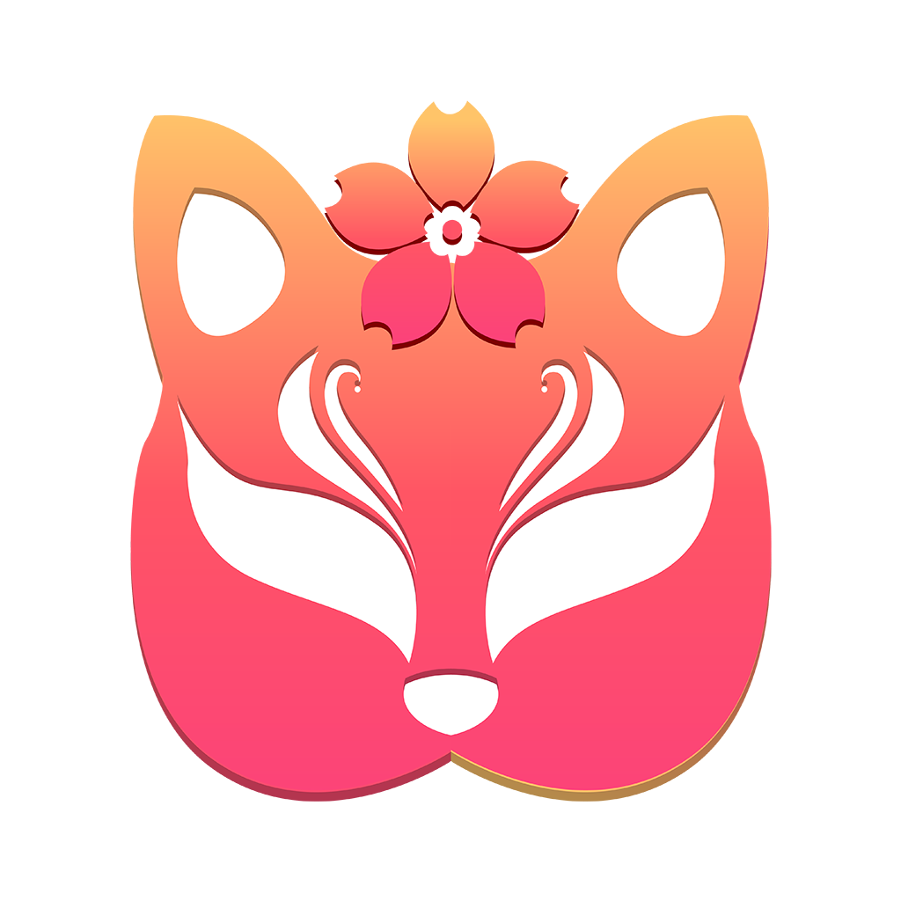

## VLink 联动！

[English](Readme.en.md)

### 简介

`VLink 联动！`可以帮助使用 `VTube Studio`、 `PrprLive` 等软件的虚拟主播进行联动，并且：

1. 基于视频分享，无需分享模型，无模型版权问题
2. 支持原生透明度，无需后处理即可显示透明背景的模型画面
3. 充分使用各种硬件加速，系统资源占用极低
4. 考虑复杂网络环境，支持P2P及中转两种传输模式
5. 无需自行部署中转服务器，内置一键创建部署中转服务器（付费）
6. 支持跨软件进行联动，任何能捕获的窗口都可以分享（这下 VTuber 会议了）

没有模型版权顾虑的主播（如朋友之间联动娱乐）推荐您使用软件内自带的如`VNet`功能进行联动！基于模型分享的方式对网络要求更低哦！但由于会多渲染几个模型所以可能会占用额外的渲染资源，与本软件相比对性能有更高要求，请根据自身情况选择合适的方案。
 
[前往详情介绍页](https://www.wolai.com/reito/dGzCn2JJCB8tnZwWd6wcRN)
  
### TODO

- [x] 使用 Grpc 重构信号服务器
- [ ] 新增强制中转服务器模式，3人以上情况下主机只需要上传一路带宽，交给中转服务器转发以节约带宽
- [ ] 重构 D3D11 相关代码

### 编译

项目界面基于`Qt`，但使用`vcpkg`及`CMake`进行管理

1. 安装[vcpkg](https://github.com/microsoft/vcpkg)
2. 使用你喜欢的IDE打开`CMakeLists.txt`
3. 选择合适的CMake编译路径及安装路径
4. 设置环境变量，如果IDE支持也可以在IDE对CMake的配置页设置，如`CLion`

  | 名称                     | 值来源                  |
  |------------------------|----------------------|
  | BACKTRACE_SUBMIT_TOKEN | https://backtrace.io |

  

5. 编译

### 许可证

[LICENSE](LICENSE) 与 [第三方许可证](https://www.wolai.com/eQGuG4smx19LYTqTtmkKtn)

### 特别感谢

此项目受 [JetBrain Open Source Development License](https://www.jetbrains.com/community/opensource/?utm_campaign=opensource&utm_content=approved&utm_medium=email&utm_source=newsletter&utm_term=jblogo#support) 支持

